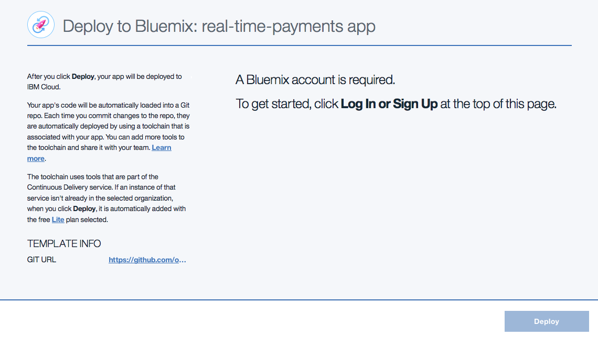
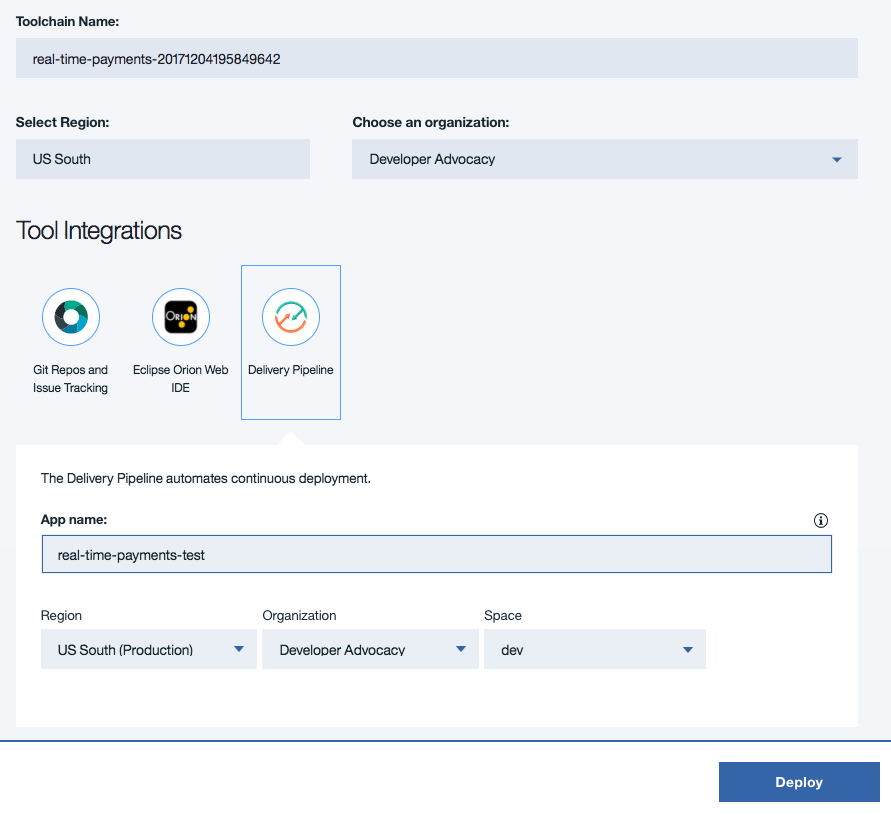
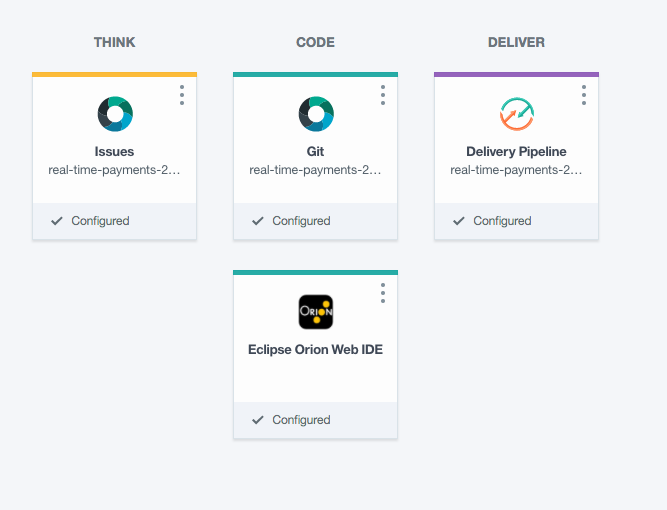
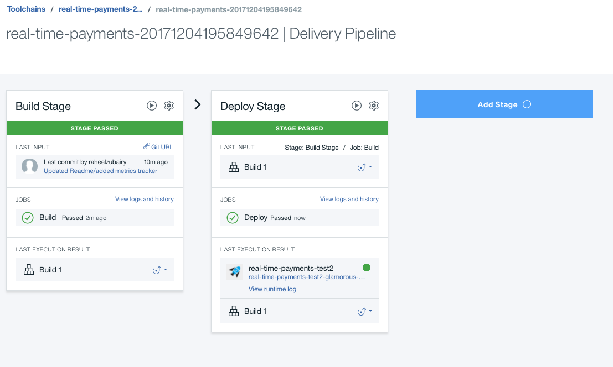

*他の言語で読む: [English](README.md).*

# Real-Time Payments

このコード・パターンでは、IBM Cloud の財務サービスを利用して、リアルタイムの決済アプリケーションを作成する方法を説明します。
IBM Cloud の財務サービスを Web インターフェースに接続し、そのインターフェースで Real-Time Payments サービスを利用してユーザーのトークンと支払い受領者を管理するという仕組みです。

このアプリケーションは、ユーザーアカウントを作成することから始めて、オンラインバンキングの経験を提供します。ユーザーのサンプル銀行口座は、小切手および普通預金口座を使用して作成されます。ユーザーが支払いを開始するためには、確認または銀行口座のためのトークンとして、電話番号もしくは電子メールを登録するように求められます。このステップを完了すると、ユーザーは、電話番号や電子メールなどのトークンを使用して、別のユーザーのアカウントに支払い、または請求することができます。すべてのユーザーアクティビティが記録され、ユーザーに表示されます。

このコードパターンを完了したら、以下のことを理解できるでしょう:


* 参加者、トークン、および受領者を管理する
* 支払い (Payments) と請求 (PaymentRequests) の開始
* トランザクション アクティビティの表示

# アーキテクチャ

<p align="center">
  
</p>

1. ユーザー A がデモ用バンキング・ポータルにログインします。ユーザー A は口座に e-メール・アドレスや電話番号をリンクしたり、e-メール・アドレスまたは電話番号で識別された支払い受領者を追加したりできます。追加した受領者 (ユーザー B など) に対しては、送金、支払い請求などのアクションを実行できます。
2. これらのアクションはすべて、アプリケーションが API 呼び出しを介して Real-time Payments サービスを利用することによって制御されます。
3. Real-time Payments サービスは Redis Cache と Cloudant DDA システムを使用して、データを保管し、リクエストを処理し、セキュリティーを確保します。
4. トランザクションが登録されて完了した後は、バンキング・ポータルからそのトランザクションを表示できます。
5. ユーザー B がログインすると、ユーザー A が送金したかどうか、または支払いを請求したかどうかを確認できます。

## 含まれるコンポーネント

+ [**Real-Time Payments**](https://console.ng.bluemix.net/catalog/services/real-time-payments-service)

## 注目のテクノロジー

+ [**Real-Time Payments API**](https://console.bluemix.net/apidocs/1152)

# IBM Cloud にデプロイする

[](https://bluemix.net/deploy?repository=https://github.com/IBM/real-time-payments)

1. デプロイする前に IBM Cloud アカウントにログインしてください。すでにログインしている場合は、この手順を無視してください。


2. このアプリはすぐにデプロイできるようになっています。アプリケーションに `App name` を指定し、Region、Organization、Space が有効であることを確認したうえで `Deploy` を押してください。


3. Toolchain でアプリがデプロイされます。eclipseIDE や git を介してコードを編集するオプションもあります。必要に応じて変更してください。


4. **Deploy Stage** がいったん完了すると、2つのステージを正常に通過したことがわかります


5. このパターン用に作成および構成されたアプリケーションとサービスを表示するには、IBM Cloud ダッシュボードを使用します

# アプリケーションをローカル環境で実行する

このコードパターンを設定してローカル環境で実行するには、以下に説明した手順に従います。

## 前提条件
- [node.js](https://nodejs.org/)
- [npm](https://www.npmjs.com/)

## 手順
1. [リポジトリをクローンする](#1-clone-the-repo)
2. [IBM Cloud (Bluemix) サービスの作成](#2-create-bluemix-services)
3. [Manifest を構成する](#3-configure-manifest)
4. [.env ファイルを構成する](#4-configure-env-file)
5. [アプリケーションを実行する](#5-run-application)

<a name="1-clone-the-repo"></a>
## 1. リポジトリをクローンする

`Real Time Payments` リポジトリをローカルにクローンします。ターミナルで以下を実行:
```
$ git clone https://github.com/IBM/real-time-payments.git
```

<a name="2-create-bluemix-services"></a>
## 2. IBM Cloud (Bluemix) サービスの作成

以下のサービスを作成します:

* [**Real-Time Payments**](https://console.ng.bluemix.net/catalog/services/real-time-payments-service)


<a name="3-configure-manifest"></a>
## 3. Manifest を構成する

コードを含むフォルダの `manifest.yml` ファイルを編集し、ユニークなアプリケーションの名前を決め、`my-real-time-payments-app` をその名前で置き換えてください。

【追加】サービス名が IBM Cloud 内のものと一致するようにサービス名を更新します。`manifest.yml`ファイルの関連部分は次のようになります：

```
declared-services:
    {Real-Time-Payments}:
      label: real-time-payments-service
      plan: real-time-payments-service-free-plan
applications:
- name: {my-real-time-payments-app}
  random-route: true
  memory: 128M
  services:
    - {Real-Time-Payments}
  env:
    NODE_TLS_REJECT_UNAUTHORIZED: 0
```

<a name="4-configure-env-file"></a>
## 4. .env ファイルを構成する

プロジェクトのリポジトリをクローンしたルートディレクトリで、サンプルの [`.env.example`](.env.example) ファイルをコピーして、`.env` ファイルを作成します。次のコマンドを使用します:
```
cp .env.example .env
```

**ノート**: ほとんどのファイルシステムで "." で始まるファイル名は、隠しファイルとして扱われます。Windowsシステムを使用している場合は、[GitBash](https://git-for-windows.github.io/) もしくは [Xcopy](https://docs.microsoft.com/en-us/windows-server/administration/windows-commands/xcopy) を使用する必要があります。

Real-time payments サービスのアクセストークンを使用して、資格情報を更新します:

```
# Real-time Payments
CRED_REAL_TIME_PAYMENTS_URL=https://ftm-proxy.mybluemix.net
CRED_SIMULATED_INSTRUMENT_ANALYTICS_ACCESSTOKEN=
```

<a name="5-run-application"></a>
## 5. アプリケーションを実行する

プロジェクトのルートディレクトリで:
+ `npm install` を実行し、必要なモジュールをインストールする
+ `runme.sh` を実行する
+ ブラウザで <http://0.0.0.0:8080/> を開き、実行中のアプリにアクセスする

# アプリケーションを使用する

このアプリケーションは、銀行のオンライン Web またはモバイルポータルをエミュレートします。お気に入りのブラウザを使用してアプリケーションを起動し、`i'm new here` を選択します。 名、姓、ユーザー名、およびパスワードを入力します。

指定されたユーザー名が存在する場合、ユーザーは標準ログインプロセスにリダイレクトされます。 そうでなければ、アプリケーションは2つの新しい口座、つまり小切手と貯蓄を作成し、'core banking system' データベースを呼び出し、各口座にいくらかのお金を入金します。また、アプリケーションは、FTM の CXCParticipant (POST) APIを呼び出すことによって参加者を作成します。

John Doe が銀行の顧客であると仮定します。

アプリケーションには、John の口座の一覧 (小切手と貯蓄) とそれぞれの残高が表示されます。 この情報は 'core banking system' データベースから取り出されます。

このアプリケーションには、「お金を支払う、もしくは請求する」オプションがあります。

### ユースケース #1. John が連絡先の追加/編集を選択

ジョンのトークンのリストが表示されます。
この情報は、FTMのCXCToken API (GET) から取得されます。
そのうちの1つをクリックすると、Johnは `contact info` (連絡先情報) を表示/編集し、自分のアカウントのリスト ('core banking system' データベースから取得) から選択することができます。
法的免責事項が表示されますので、受諾を示すチェックボックスをチェックします。
`Continue` をクリックすると確認ページが表示され、`Add email/mobile #` (メール/携帯電話番号を追加する) をクリックすると FTM の CXCToken API (POST) が呼び出されます。
John は、FTM の CXCToken API (PUT) を使用してトークンを `Edit` もできます。
またトークンを `Delete` することもでき、「本当ですか？」の確認の後、FTM の CXCToken API（DELETE）が呼び出されます。

John は `Add another email/mobile #` (別のメール/携帯電話番号を追加する) ことがあります。
`contact info` フィールドはフリーテキストで、`deposit account` (預金口座) は自分の口座の一覧で、'core banking system' データベースから取得したものです。
法的免責事項が表示されますので、受諾を示すチェックボックスをチェックします。
`Continue` をクリックすると確認ページが表示され、`Add email/mobile #` をクリックすると FTM の CXCToken API (POST) が呼び出されます。

次に、John は "Add Recipients" を選択します。

John の受領者のリストが表示されます。
この情報は、FTM の CXCRecipient API (GET) から取得されます。
それらの1つをクリックすると、John は `recipient details` (受領者の詳細) を表示/編集できます。
詳細は、FTM の CXCRecipient API (GET) から取得します。
John は `Add New Recipient` (新しい受領者を追加する) ことがあります。
モバイル番号またはメールアドレス、名字、姓の入力欄はフリーテキストです。
`Continue` をクリックすると確認ページが表示され、`Add recipient` をクリックすると FTM の CXCRecipient API (POST) が呼び出されます。
John は、FTM の CXCRecipient API (PUT) を使用して受信者を `Edit` もできます。
また受信者を `Delete` することもでき、「本当ですか？」の確認の後、FTM の CXCRecipient API（DELETE）が呼び出されます。

### ユースケース #2. John が支払いを選択

John は FTM の CXCRecipient API (GET) から取得したリストから受領者を選択するか、メール/モバイル番号を手動で入力することができます。
次の画面では、FTM の CXCToken API (GET) から取得した金額 (USD$) と元になるアカウントの一覧を表示します。
`Continue` をクリックすると確認ページが表示され、`Send` (支払い) をクリックすると FTM の CXCPayment API (POST) が呼び出されます。
FTM は、'core banking system' データベースを再び呼び出し、ジョンの口座から選択された金額を支払います。
FTM は、User Exit を呼び出すことによって、電子メール (またはSMS) を介して受領者に通知します。

### ユースケース #3. John が請求を選択

John は FTM の CXCRecipient API (GET) から取得したリストから受領者を選択するか、メール/モバイル番号を手動で入力することができます。
次の画面では、FTM の CXCToken API (GET) から取得した金額 (USD$) と元になるアカウントの一覧を表示します。
`Continue` をクリックすると確認ページが表示され、`Request` (請求) をクリックすると FTM の CXCPaymentRequest API (POST) が呼び出されます。
FTM は、User Exit を呼び出すことによって、電子メール (またはSMS) を介して受領者に通知します。

次に、John は "View Activity" を選択できます。

ステータスのリストが表示されます (受け入れ済み、完了、配信済み、期限切れ、失敗、保留、送信済み)。
それぞれを選択することができ、CXCPayment API と CXCPaymentRequest API (GET) からそのステータスの支払いリストを取得できます。
選択された各トランザクションを表示することができ、データは CXCPayment または CXCPaymentRequest API (GET) から取得されます。

John はアプリケーションからログアウトします。

### ユースケース #4. Billy Fishは、銀行で働く開発者です。彼は銀行オペレーターが決済ハブの運営を監視するためのポータルを構築しています。

Webブラウザを使用して、Billy は IBM Cloud (Bluemix) Console にログオンし、FTM for Real Time Payments API に移動します。
ユーザー名・パスワード・API キーは、FTM の REST API で使用する秘密のユーザー名とパスワードを保持する API プロキシによって検証されます。

Billy は FTM のコア読み取り専用APIを使用することができ、inboundTransactions (GET) を表示することを選択します。

FTM の Real Time Payments API コールの詳細については [こちら](https://console.bluemix.net/apidocs/1152) をご覧ください。

Billy は IBM Cloud (Bluemix) からログアウトします。

# トラブルシューティング

* IBM Cloud (Bluemix) アプリケーションのトラブルシューティングを行うには、ログを使用します。ログを表示するには、次のコマンドを実行します:
```bash
cf logs <application-name> --recent
```


# ライセンス

[Apache 2.0](LICENSE)
